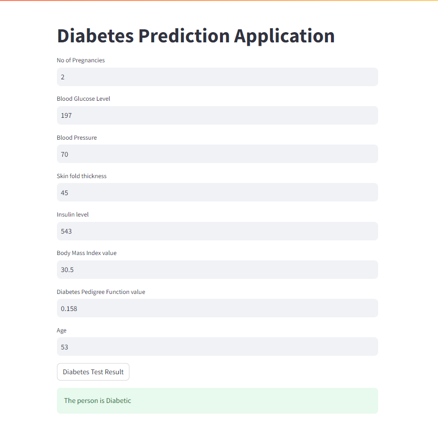

# Diabetes Predictor ML Model


The Diabetes Predictor ML Model is a machine learning model built to predict whether a person has diabetes or not based on certain parameters. It utilizes Support Vector Machine (SVM) as the classifier and is trained on the PIMA Diabetes dataset. The model takes into account the following parameters:

- Pregnancies
- Glucose
- Blood Pressure
- Skin Thickness
- Insulin
- BMI (Body Mass Index)
- Diabetes Pedigree Function
- Age

## Files

- **Diabetes_Predictor.ipynb**: The actual python notebook of the model.
- **diabetes.csv**: The database used to train and test the model.
- **diabetes_model.sav**: This file contains the trained SVM model.
- **deployed_model.py**: UI created using Streamlit for dynamic input of the data.

## Usage

1. Ensure you have Python installed on your system.
2. Install the required dependencies.
3. Once the server is running, you can make predictions by sending HTTP POST requests to `http://localhost:5000/predict` with the parameters in JSON format.

4. You can use `test.py` to check if the API is working correctly:

```bash
python test.py
```

## Model Training

The model is trained using the PIMA Diabetes dataset, which contains various health-related parameters of individuals. The SVM classifier is trained to predict whether a person has diabetes or not based on these parameters.

## UI Interface

The UI interface created with Streamlit module of Python allows users to dynamically input data and get predictions instantly.

## Dataset

The PIMA Diabetes dataset is commonly used for predicting diabetes occurrence based on diagnostic measures.

## Note

- This model should be used for educational and experimental purposes only.
- Ensure that you have the necessary permissions to deploy and use RESTful APIs on your local machine.

## About

The Diabetes Predictor ML Model is developed and maintained by Aswin A Nair. Feel free to reach out with any questions or feedback.

---

Predict diabetes risk with confidence using the Diabetes Predictor ML Model! If you have any questions or encounter any issues, don't hesitate to contact us.
